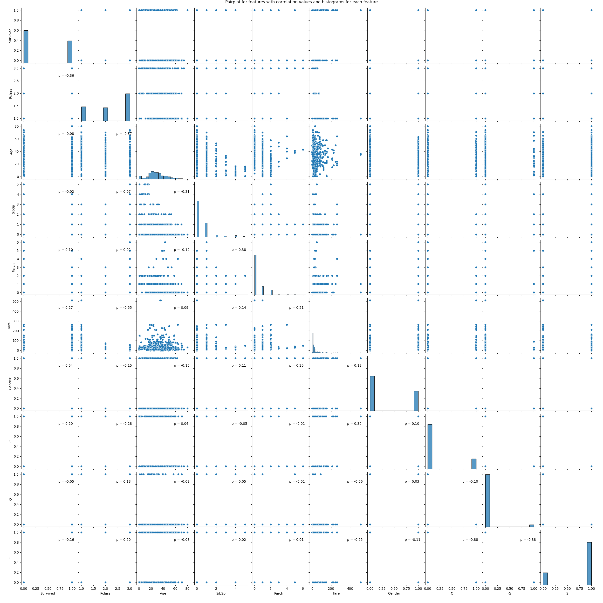
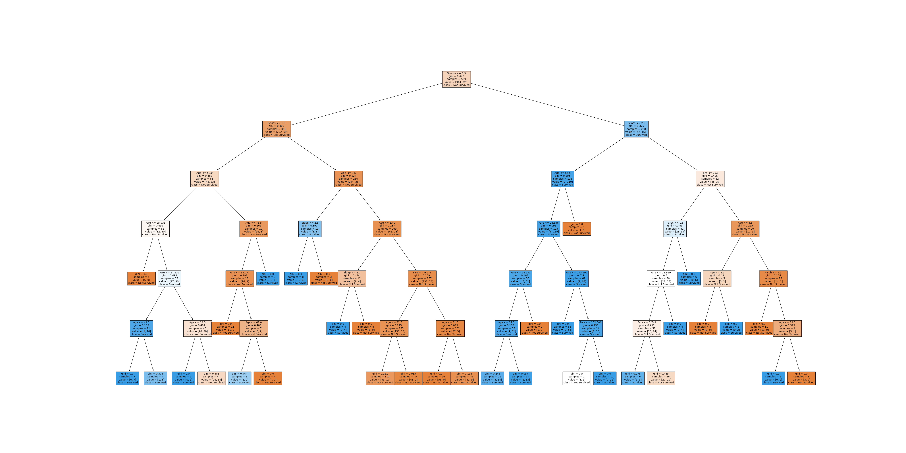

# Data Analysis Cookbook

*by Younginn Park*

Examples of fundamental data science workflows on Titanic passenger data

## Contents

The dataset used in this project involves passenger data from RMS Titanic ([Kaggle dataset](https://www.kaggle.com/c/titanic/data)).

The project aims to present simple workflows for basic methods for data analysis and data modeling using Python (sklearn, tensorflow with keras API), at the same time exploring ways to optimize model parameters.

Models used here include:
- Decision trees
- Random forest
- SVM
- Multilayer Perceptron and Neural Network

## Results

### Data exploration

- `data_clean.py` - script for cleaning raw data and feature selection from `train.csv` (and `test.csv`)
- `data_explore.py` - script for correlation table and pairplot (histogram and scatterplot for each pair of selected features, saved as `corr_plot.png` in `plots`)

Figure. Pairplot of features. Histograms on the diagonal. Scatterplots on the lower triangular of the feature matrix have correlation coefficient in upper right corner.

#### Correlations to the 'Survived' label

|Feature   | Correlation coeff. with Survived |
|----------|----------------------------------|
| Pclass   |  -0.356462                       |
| Age      |  -0.082446                       |
| SibSp    |  -0.015523                       |
| Parch    |   0.095265                       |
| Fare     |   0.266100                       |
| Gender*  |   **0.536762**                   |
| C**      |   0.195673                       |
| Q        |  -0.048966                       |
| S        |  -0.159015                       |

*0 is for male and 1 for female
**C,Q,S - one-hot encoded features for the port of embarkment

Features like names, ticket ids were excluded because they are non-informative for the prediction model. Cabin number was removed for the same reason, plus there were too many missing values.

### Models
#### Decision Tree

`model_dt.py` - script for running the model

Max depth from 1 to 20 were tested and 3 methods for selecting number of features when looking for best splits - `sqrt`, `log2` and `None` (raw n_features).

| Max depth | Max features |   Mean CV accuracy|
|--|---|--|
|6|         None     |  0.808430 |
|5         |None            | 0.804891 |
|4         |log2            | 0.801335 |
|4         |sqrt            | 0.801335 |
|7         |None            | 0.799658 |

The best model had max_depth=6 and max_features=None (n_features). It got accuracy of 0.75 on validation set.
The best tree was visualized as an image in `best_dt.png`.

Figure. Best decision tree

#### Random Forest

`model_rf.py`

Parameters in grid search
- 'n_estimators': [100, 200, 300],
- 'max_depth': range(1, 21),
- 'max_features': ['sqrt', 'log2', None]

|Max Depth| Max Features| N Estimators|  Mean Test Accuracy|
|--|--|--|--|
|6 |        None|          200|            0.819003|
|5  |       None |         200 |           0.817202|
|6   |      log2  |        300  |          0.815463|
|6    |     sqrt   |       300   |         0.815463|
|5     |    None   |       300    |        0.815448|

Best Random Forest Parameters: {'max_depth': 6, 'max_features': None, 'n_estimators': 200}
Random Forest Validation Accuracy: 0.75

#### Nearest Neighbors

`model_nn.py`

Parameters in grid search
- 'n_neighbors': range(15, 36),
- 'weights': ['uniform', 'distance']

|N Neighbors|   Weights | Mean Test Accuracy|
|-|-|-|
|21   |uniform            |0.722310|
|19   |uniform            |0.720602|
|20   |uniform            |0.720556|
|28  |distance            |0.718848|
|22   |uniform            |0.717063|

Best KNN Parameters: {'n_neighbors': 21, 'weights': 'uniform'}
KNN Validation Accuracy: 0.64

#### Support Vector Machine

`model_svm.py`

Parameters in grid search
- 'svc__C': [1, 10, 100, 500, 1000],
- 'svc__gamma': [1, 0.1, 0.01]

| C  |  Gamma  | Mean Test Accuracy |
|-|-|-|
|100|        0.01|            0.815494|
|1        |0.10            |0.801428|
|500       | 0.01            |0.799674|
|100       | 0.10            |0.796181|
|10       | 0.10            |0.794426|

Best SVM Parameters: {'svc__C': 100, 'svc__gamma': 0.01}
SVM Validation Accuracy: 0.82

#### Multilayer Perceptron

`model_mlp.py`

Parameters in grid search:
- 'mlp__hidden_layer_sizes': [(50, 50), (100,)],
- 'mlp__activation': ['relu', 'tanh'],
- 'mlp__solver': ['adam' , 'lbfgs'] # lbfgs - often fails to converge even after increasing max_iter

|   Activation | Hidden Layer Sizes |  Solver |  Mean Test Accuracy |
|-|-|-|-|
|relu|                (50, 50)|        adam |            0.810278|
|tanh |               (50, 50) |       adam  |          0.801428|
|tanh  |                (100,)  |      adam  |          0.799705|
|relu   |               (100,)   |     adam   |         0.797920|
|relu    |            (50, 50)    |   lbfgs    |        0.738146|

Best MLP Parameters: {'mlp__activation': 'relu', 'mlp__hidden_layer_sizes': (50, 50), 'mlp__solver': 'adam'}
MLP Validation Accuracy: 0.78

#### Neural Network (Tensorflow)

Only one architecture was tested. Adam optimizer was used with learning rate of 0.01 with 10 epochs and batch size of 32

| Layer (type)                         | Output Shape                |         Param # |
|--|--|--|
| dense (Dense)                        | (None, 128)                 |          1,280 |
| dense_1 (Dense)                      | (None, 64)                  |           8,256 |
| dense_2 (Dense)                      | (None, 32)                  |           2,080 |
| dense_3 (Dense)                      | (None, 1)                   |              33 |

Validation Accuracy: 0.81

### Conclusions

SVM and Neural Network in tensorflow had the best accuracy on the validation set, 0.82 and 0.81 respectively. Nearest Neighbors is the simplest method and it performed the worst on the validation set.
